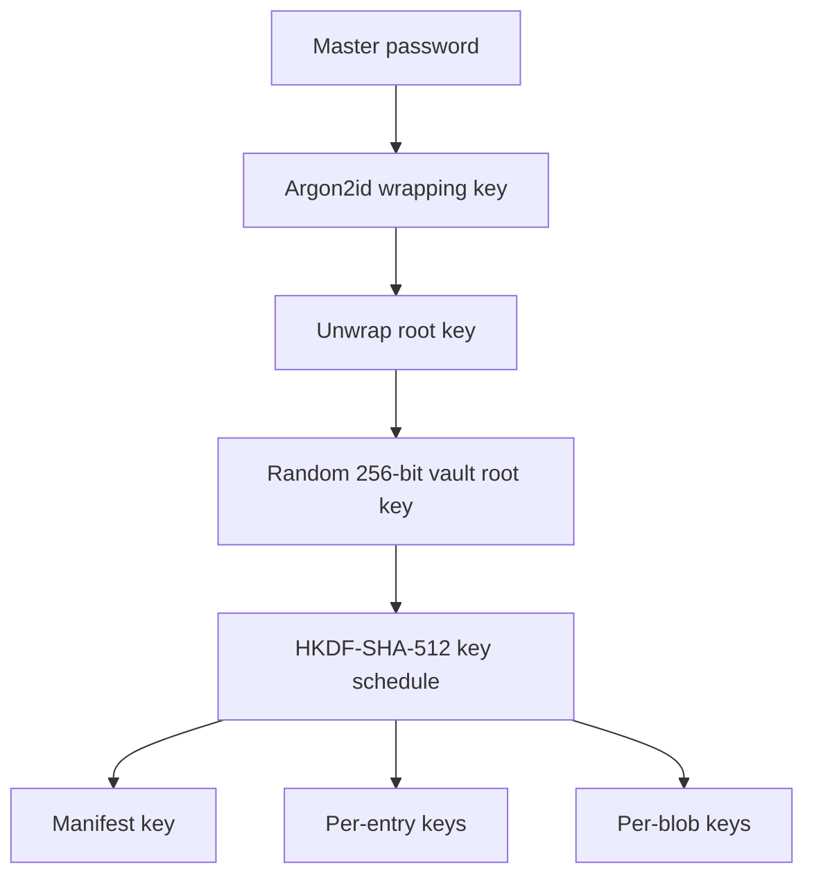

# Cripty

Cripty is a local-first desktop vault for encrypted credentials, structured notes, TOTP secrets, and images. It combines a practical Avalonia UI with an explicitly layered .NET architecture and an authenticated, versioned storage format.

The project is designed around one central rule: sensitive vault content is encrypted before it is persisted. Folder names, tags, entry names, field names, field contents, and image data are stored inside authenticated encrypted payloads.

> **Project status:** Cripty is under active development and has not undergone an independent security audit. It is a portfolio project, not a claim of production-grade or formally verified security. Review the [security scope](#security-scope-and-limitations) before storing real secrets.

## Demo


## Features

- Create and manage multiple independent local vaults.
- Organize entries in nested folders and assign reusable tags.
- Search entries, filter by folder or tag, and retain per-folder sort preferences.
- Sort by name, creation time, modification time, or a user-selected timeline date.
- Build entries from username, password, email, website, TOTP, notes, unnamed, or custom text fields.
- Reorder, rename, collapse, copy, inspect, and remove individual fields.
- Format note fields with a deliberately limited Markdown-like editor and preview.
- Paste, replace, expand, encrypt, and store PNG images as separate blob files.
- Generate passwords from a target entropy and a selectable character set.
- Inspect passwords character by character without sending them to an external service.
- Generate TOTP authentication codes locally from valid `otpauth://` provisioning URIs.
- Stage edits and explicitly save or revert them.
- Move folders and entries within a vault, or copy selected folder trees and entries into another vault.
- Change a vault password by generating a fresh root key and re-encrypting every entry and blob.
- Automatically lock and close after five minutes without keyboard, click, or scroll interaction. The final minute displays a warning; timeout discards unsaved changes.
- Export and import complete encrypted snapshots through a user-selected folder, including a folder synchronized by an external cloud provider.
- Create a recovery backup before replacing a different local version of the same vault.

## Security design

Cripty uses an envelope-based key hierarchy. The master password protects a randomly generated vault root key; it is not used directly to encrypt vault content.



### Key derivation and encryption

- **Password KDF:** Argon2id version 1.3 with a random 128-bit salt. The default profile uses 64 MiB of memory, 3 iterations, and 4 lanes. Validated custom parameters can be selected when creating a vault or changing its password.
- **Root key:** 256 random bits generated with the platform cryptographic random-number generator.
- **Key separation:** HKDF-SHA-512 derives independent manifest, entry, and blob keys. Purpose labels, the vault ID, and the relevant entry or blob ID provide domain separation.
- **Authenticated encryption:** an A256CBC-HS512 encrypt-then-MAC construction: AES-256-CBC with a fresh 128-bit IV, plus HMAC-SHA-512 truncated to a 256-bit authentication tag.
- **Authentication before decryption:** tags are checked in fixed time before CBC decryption is attempted. Invalid envelopes return a generic failure rather than exposing padding details.
- **Context binding:** authenticated associated data binds each payload to its type, storage-format version, vault ID, and, where applicable, entry or blob ID.
- **Key handling:** derived-key, root-key, and plaintext byte buffers are cleared where the runtime representation permits it.

### What is encrypted

| Data | At-rest representation |
| --- | --- |
| Folder and tag names, hierarchy, entry names, tag assignments, revisions, dates, and sort preferences | Authenticated encrypted manifest |
| Field names and text values, including passwords and TOTP provisioning URIs | Individually authenticated encrypted entry files |
| PNG image bytes | Individually authenticated encrypted blob files |
| Vault root key | Authenticated envelope protected by the Argon2id-derived wrapping key |

The vault directory is split into a small encrypted manifest and independent entry/blob envelopes. This avoids rewriting every entry whenever only the manifest changes and allows each object to receive a separately derived key.

| Path | Purpose |
| --- | --- |
| `vault.cripty` | Format information, password key slot, and encrypted manifest |
| `entries/<entry-id>.entry` | One authenticated encrypted entry payload |
| `blobs/<blob-id>.blob` | One authenticated encrypted image payload |

Each individual vault, entry, and blob file is written to a temporary file, flushed, and atomically moved into place. A complete save can update several files, however, so the vault as a whole is not a single filesystem transaction.

### Password rotation

Changing the password performs a full key rotation rather than merely re-wrapping the existing root key:

1. Generate a new random vault root key.
2. Re-encrypt the manifest, every entry, and every blob under keys derived from the new root key.
3. Verify the rotated vault before it replaces the current vault.
4. Preserve the vault ID, folders, tags, entries, and their organization.

The operation needs temporary free space approximately equal to the size of the vault.

### Encrypted backups

Cripty does not connect directly to a cloud account. It exports a complete, already-encrypted snapshot into a folder chosen by the user. A separate synchronization client can then upload that folder.

Backup indexes record file paths, sizes, and SHA-256 hashes so an import can verify that the snapshot is complete before replacement. The index is operational metadata, not encrypted vault content.

## Security scope and limitations

Cripty is intended to protect vault contents **at rest** when an attacker obtains a copy of the vault files but does not know the master password. Authentication also makes modification, substitution, and corruption of encrypted payloads detectable.

It does not attempt to protect secrets from:

- malware, keyloggers, screen capture, debuggers, or an administrator controlling the host while the vault is unlocked;
- operating-system paging, hibernation, crash dumps, or other platform-managed memory persistence;
- exposure through the system clipboard after the user copies a value;
- weak or reused master passwords;
- replacement of the entire vault with an older, internally valid snapshot on a device that has no trusted record of the latest generation;
- metadata visible outside encrypted payloads, including vault directory names, format versions, vault/object identifiers, file counts and sizes, backup timestamps, and backup-index contents;
- failures spanning a multi-file save, because atomic replacement is guaranteed per file rather than for the entire vault directory;
- a hostile or already-compromised local filesystem.

These boundaries are deliberate and should be considered when evaluating or extending the project.

## Architecture

The solution keeps domain logic, cryptography, persistence, application workflows, and UI concerns in separate projects.

| Project | Responsibility |
| --- | --- |
| `Cripty` | Avalonia desktop UI, MVVM view models, interaction tracking, and desktop services |
| `Cripty.Application` | Vault sessions, saves, cross-vault copy, backup/import workflows, and root-key rotation |
| `Cripty.Core` | Vault, folder, tag, entry, field, indexing, sorting, and validation domain models |
| `Cripty.Cryptography` | Argon2id, HKDF, AES-CBC/HMAC envelopes, password generation, and TOTP generation |
| `Cripty.Storage` | Versioned DTOs, domain mapping, associated data, codecs, file formats, and atomic file stores |
| `*.Tests` | MSTest coverage for cryptographic primitives, storage codecs/stores, application workflows, and UI-facing logic |

Notable design choices include:

- compiler-enforced project boundaries rather than a single UI-heavy assembly;
- explicit DTO-to-domain mapping so the persisted schema can evolve independently;
- stable GUID identities for vaults, entries, fields, folders, tags, and blobs;
- a manifest index for fast folder/tag queries without duplicating the persisted source of truth;
- generation and revision tracking for saves, backups, and conflict decisions;
- service APIs structured for failure-path and tamper-case testing.

## Documentation

- [Architecture](docs/ARCHITECTURE.md) — component boundaries, dependencies, persistence, and application workflows.
- [Security model](docs/SECURITY-MODEL.md) — protected assets, threat model, cryptographic design, and trust assumptions.
- [Vault format](docs/VAULT-FORMAT.md) — serialized records, encryption envelopes, key derivation, validation, and compatibility rules.
- [Known limitations](docs/KNOWN-LIMITATIONS.md) — accepted engineering debt, security boundaries, and conditions requiring reconsideration.

## Technology

- C# and .NET 10
- Avalonia 12.1
- CommunityToolkit.Mvvm 8.4
- Konscious.Security.Cryptography.Argon2 1.3
- MSTest 4

## Build and run

### Prerequisites

- [.NET 10 SDK](https://dotnet.microsoft.com/download/dotnet/10.0)
- Git

Clone and run the desktop project:

```bash
git clone https://github.com/BercoviciAdrian/Cripty.App.git
cd Cripty.App
dotnet restore Cripty.App.slnx
dotnet run --project Cripty/Cripty.csproj --configuration Release
```

By default, vaults are created under `Documents/Cripty Vaults`. The location can be changed from the vault-selection screen.

### Run the full test suite

```bash
dotnet test Cripty.App.slnx --configuration Release
```

### Create self-contained builds

Windows x64:

```bash
dotnet publish Cripty/Cripty.csproj --configuration Release --runtime win-x64 --self-contained true --output artifacts/win-x64
```

Linux x64:

```bash
dotnet publish Cripty/Cripty.csproj --configuration Release --runtime linux-x64 --self-contained true --output artifacts/linux-x64
```

Test projects are referenced by the solution but are not included in the published desktop application.

## Basic workflow

1. Choose the default vault location or another local folder.
2. Create a named vault and choose its master password and Argon2id parameters.
3. Add folders, tags, and entries, then populate entries with text fields or pasted PNG images.
4. Save staged changes explicitly.
5. Lock the vault when finished.
6. Optionally export an encrypted snapshot to a synchronized backup folder.

Cripty does not create or store a password-recovery secret. Losing the master password means losing access to that vault, so retain verified backups and a safe recovery plan.

## Repository notes

- Packaged releases are not currently published; build the application from source.
- The repository currently has no software license. Public source visibility does not by itself grant permission to use, modify, or redistribute the code.
- When reporting a problem, never attach a real vault, password, TOTP secret, or other sensitive content.